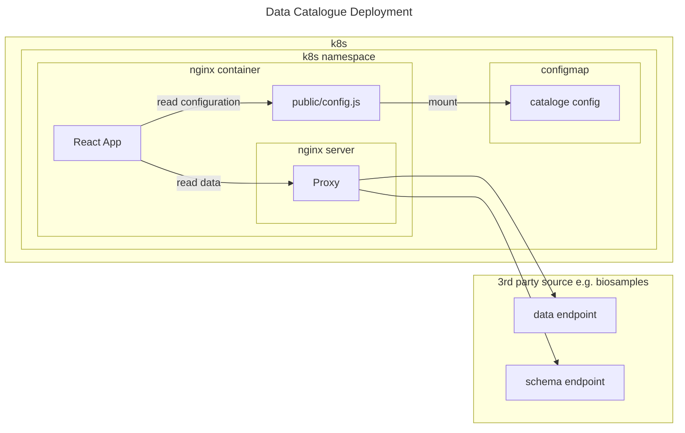

# Data Catalogue
## Architecture
The data catalogue is a client side web app that 
## Development

- This project was bootstrapped with [Create React App](https://github.com/facebook/create-react-app).
- The grid is implemented using ag-grid
- configuration is done by setting values in a file in the public folder.

### Run locally
* install node see package.json for supported node version. 
* install: run `npm install`
* start the app: `npm start`
* view the app: Open [http://localhost:3000](http://localhost:3000) to view it in the browser.
* test: run `npm test` to launch the test runner in the interactive watch mode. See the section about [running tests](https://facebook.github.io/create-react-app/docs/running-tests) for more information.

## configuration
This app allows configuring the following:
- data location - as json endpoint
- styling - as css
- grid behaviour - filters, columns, cell rendering

The configuration will be files in the public directory, that will be provided for each project's deployment environment.
In a k8s environment the config files will be configmaps mounted as files in the container running the app.
See [this article about runtime configuration for react](https://profinit.eu/en/blog/build-once-deploy-many-in-react-dynamic-configuration-properties/)
See the diagram below.

## Deployment
* The react app is built and copied to a nginx server that is packaged as a docker image. See [./Dockerfile](./Dockerfile)
* The app gets its configuration from the config.js file in the public directory. See 
* The nginx server proxies requests to 3rd party services where the data is stored on.
* This app image is deployed to a k8s cluster
* The configuration file as defined as a configmap and mounted so that the app has access to it.

The following diagram summarizes this:

## Learn More

You can learn more in the [Create React App documentation](https://facebook.github.io/create-react-app/docs/getting-started).

To learn React, check out the [React documentation](https://reactjs.org/).
